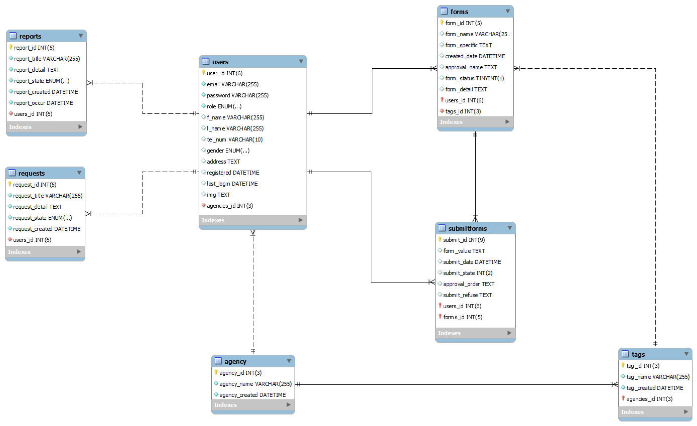
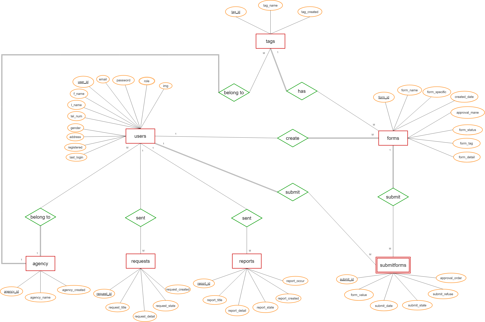

 

<h3 align="center">Academic Petition Service Prototype</h3>

---

 All in one Docker Compose to Run About DATABASE in use !
      

## 📊 ER-diagram

 

 

## 🏁 Getting Started 

Install Docker, Docker-compose to Deploy it

## 🚀 Deployment 

    docker-compose up -d

## 🌲 .ENV File Using 

    ROOT_PWD
    DB_PORT
    DB_SQL_FILE
    DB_NAME
    PMA_PORT

- [MYSQL](https://www.mysql.com/) - Database
- [PHPMYADMIN](https://www.phpmyadmin.net/) - Database Management
- [NGINX](https://www.nginx.com/) - Imagestore
- [NodeJs](https://nodejs.org/en/) - Server Environment

## ✍️ Authors 

- [@SimonHope](https://github.com/SimonHope)

See also the list of [contributors](https://github.com/kylelobo/The-Documentation-Compendium/contributors) who participated in this project.

## 🎉 Acknowledgements 

- https://docs.docker.com/compose/
